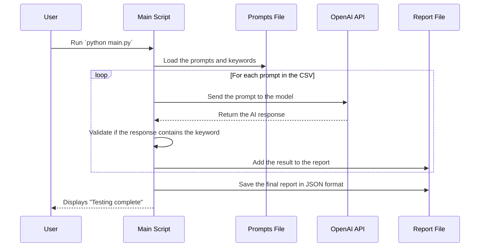

# AI Agent Tester


        


A simple application for testing an AI Agent by sending multiple prompts and validating the responses based on expected keywords.

## 🎯 Objective

The main objective of this application is to automate the testing process of an AI Agent (such as OpenAI's GPT). The script reads a list of prompts from a CSV file, sends each prompt to the OpenAI API, and checks if the response contains a specific keyword. At the end, a detailed report in JSON format is generated with the result of each test (Success or Failure).

## ⚙️ How It Works

The application execution flow is as follows:



## 🚀 Getting Started

Follow the steps below to set up and run the project.

### Prerequisites

- Python 3.10 or higher
- An OpenAI API key

### Installation

1. Clone the repository:
```bash
git clone <YOUR_REPOSITORY_URL>
cd agent_test
```

2. Create and activate a virtual environment (recommended):
```bash
python -m venv venv
source venv/bin/activate # On Windows, use `venv\Scripts\activate`
```

3. Install the dependencies:
```bash
pip install -r requirements.txt
```

4. Create a `.env` file in the project root and add your OpenAI key:
```
OPENAI_API_KEY="your_secret_key_here"
```

### Setting Up the Tests

Edit the `prompts.csv` file to add the prompts you want to test. Each line must contain a `prompt` and the `target_word` (expected keyword in the response).

```csv
prompt,target_word
"What is the capital of France?","Paris"
"Describe the sun.","star"
```

### Execution

To run the tests, execute the main script:
```bash
python main.py
```

At the end of the execution, a `report.log` file will be created in the project root with detailed results.

## 🧪 Running the Tests

To run the project's automated test suite, use the following command:
```bash
python -m unittest discover tests
```

## 🤝 Contributing

Contributions are welcome! Please read our contributing guide to understand our code guidelines and submission process.

## 📄 License

This project is licensed under the MIT License. See the `LICENSE` file for more details.
